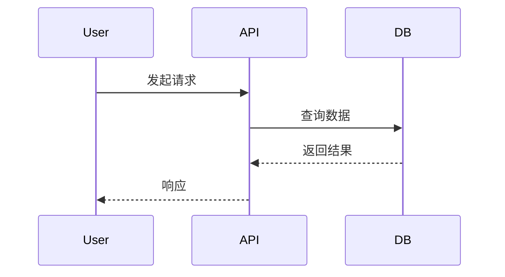

# 核心业务流程说明

## 1. [核心流程名称，如：订单支付流程]

### 1.1 流程图

```mermaid
sequenceDiagram
    participant User
    participant API
    participant DB
    User->>API: 发起请求
    API->>DB: 查询数据
    DB-->>API: 返回结果
    API-->>User: 响应
```

### 1.2 核心逻辑伪代码
```python
def process_order(order_id):
    # 1. 校验库存
    # 2. 扣减余额
    # 3. 生成支付单
    pass
```
