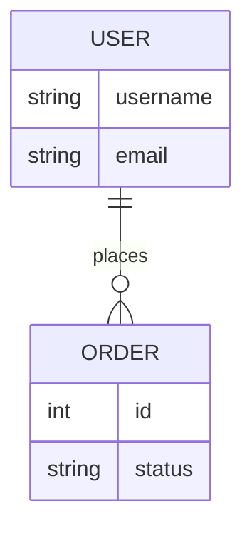

# 数据库设计说明书

## 1. 约定
- **命名规范**：[如 snake_case]
- **字符集**：utf8mb4

## 2. ER 图

## 3. 表结构定义

### 3.1 `users` 表
| 字段名 | 类型 | 长度 | 是否为空 | 主键 | 说明 |
| :--- | :--- | :--- | :--- | :--- | :--- |
| id | bigint | 20 | NO | YES | 自增主键 |
| created_at | datetime | | NO | | 创建时间 |
